# Architecture SpiistMove

```mermaid
flowchart TD

subgraph group_client["React Client"]
  node_web_app["React Application<br/>[App.tsx]"]
  node_auth_ui["Auth Context<br/>[AuthContext.tsx]"]
  node_parcel_ui["Parcel Posting<br/>[PosterColis.tsx]"]
  node_search_ui["Parcel Search<br/>[Recherche.tsx]"]
  node_booking_ui["Reservation Flow"]
  node_payment_ui["Payment Screen<br/>[Paiement.tsx]"]
  node_tracking_ui["Delivery Tracking<br/>[Suivi.tsx]"]
  node_messaging_ui["Messaging UI<br/>[Messagerie.tsx]"]
  node_api_client["API Client<br/>[api.ts]"]
  node_transporter_stats["Transporter Stats"]
end

subgraph group_api["Django API"]
  node_api_router["API Router<br/>[urls.py]"]
  node_identity_api["Identity API<br/>[views.py]"]
  node_identity_store[("Identity Store<br/>[models.py]")]
end

subgraph group_shipping["Shipping Domain"]
  node_shipping_api["Shipping API<br/>[views.py]"]
  node_shipping_store[("Shipping Store<br/>[models.py]")]
  node_messaging_api["Messaging API<br/>[views.py]"]
end

subgraph group_finance["Payments Wallet"]
  node_payment_api["Payment API<br/>[paiement_views.py]"]
  node_wallet["Commission Wallet<br/>[wallet.py]"]
end

subgraph group_operations["Admin Operations"]
  node_admin_ui["Admin Console<br/>[AdminIndex.tsx]"]
  node_admin_api["Admin API<br/>[admin_views.py]"]
end

node_sender(("Sender / Transporter"))
node_admin_actor(("Administrator"))
node_kkiapay["Kkiapay"]
node_fedapay["FedaPay"]

node_sender -->|"uses"| node_web_app
node_admin_actor -->|"manages"| node_admin_ui
node_web_app -->|"routes"| node_auth_ui
node_web_app -->|"routes"| node_parcel_ui
node_web_app -->|"routes"| node_search_ui
node_web_app -->|"routes"| node_booking_ui
node_web_app -->|"routes"| node_payment_ui
node_web_app -->|"routes"| node_tracking_ui
node_web_app -->|"routes"| node_messaging_ui
node_web_app -->|"routes"| node_admin_ui
node_auth_ui -->|"calls"| node_api_client
node_parcel_ui -->|"calls"| node_api_client
node_search_ui -->|"calls"| node_api_client
node_booking_ui -->|"calls"| node_api_client
node_payment_ui -->|"calls"| node_api_client
node_tracking_ui -->|"calls"| node_api_client
node_messaging_ui -->|"calls"| node_api_client
node_transporter_stats -->|"calls"| node_api_client
node_admin_ui -->|"calls"| node_api_client
node_api_client -->|"requests"| node_api_router
node_api_router -->|"dispatches"| node_identity_api
node_api_router -->|"dispatches"| node_shipping_api
node_api_router -->|"dispatches"| node_payment_api
node_api_router -->|"dispatches"| node_admin_api
node_identity_api -->|"reads/writes"| node_identity_store
node_shipping_api -->|"reads/writes"| node_shipping_store
node_payment_api -->|"records payments"| node_shipping_store
node_payment_api -.->|"verifies payment"| node_kkiapay
node_payment_api -.->|"verifies payment"| node_fedapay
node_shipping_api -->|"allocates commission"| node_wallet
node_wallet -->|"updates balances"| node_shipping_store
node_admin_api -->|"moderates delivery"| node_shipping_store
node_admin_api -->|"processes withdrawals"| node_wallet
node_admin_api -.->|"pays out"| node_kkiapay
node_admin_api -.->|"pays out"| node_fedapay
node_messaging_ui -->|"sends messages"| node_messaging_api
node_messaging_api -->|"stores messages"| node_shipping_store

click node_web_app "https://github.com/elfred434/transport/blob/main/frontend/src/App.tsx"
click node_auth_ui "https://github.com/elfred434/transport/blob/main/frontend/src/context/AuthContext.tsx"
click node_parcel_ui "https://github.com/elfred434/transport/blob/main/frontend/src/pages/PosterColis.tsx"
click node_search_ui "https://github.com/elfred434/transport/blob/main/frontend/src/pages/Recherche.tsx"
click node_booking_ui "https://github.com/elfred434/transport/blob/main/frontend/src/pages/ReservationColis.tsx"
click node_payment_ui "https://github.com/elfred434/transport/blob/main/frontend/src/pages/Paiement.tsx"
click node_tracking_ui "https://github.com/elfred434/transport/blob/main/frontend/src/pages/Suivi.tsx"
click node_messaging_ui "https://github.com/elfred434/transport/blob/main/frontend/src/pages/Messagerie.tsx"
click node_admin_ui "https://github.com/elfred434/transport/blob/main/frontend/src/pages/admin/AdminIndex.tsx"
click node_api_client "https://github.com/elfred434/transport/blob/main/frontend/src/lib/api.ts"
click node_api_router "https://github.com/elfred434/transport/blob/main/backend_django/config/urls.py"
click node_identity_api "https://github.com/elfred434/transport/blob/main/backend_django/accounts/views.py"
click node_identity_store "https://github.com/elfred434/transport/blob/main/backend_django/accounts/models.py"
click node_shipping_api "https://github.com/elfred434/transport/blob/main/backend_django/shipping/views.py"
click node_shipping_store "https://github.com/elfred434/transport/blob/main/backend_django/shipping/models.py"
click node_payment_api "https://github.com/elfred434/transport/blob/main/backend_django/shipping/paiement_views.py"
click node_wallet "https://github.com/elfred434/transport/blob/main/backend_django/shipping/wallet.py"
click node_admin_api "https://github.com/elfred434/transport/blob/main/backend_django/shipping/admin_views.py"
click node_messaging_api "https://github.com/elfred434/transport/blob/main/backend_django/shipping/views.py"
click node_transporter_stats "https://github.com/elfred434/transport/blob/main/frontend/src/pages/TransporteurStats.tsx"

classDef toneNeutral fill:#f8fafc,stroke:#334155,stroke-width:1.5px,color:#0f172a
classDef toneBlue fill:#dbeafe,stroke:#2563eb,stroke-width:1.5px,color:#172554
classDef toneAmber fill:#fef3c7,stroke:#d97706,stroke-width:1.5px,color:#78350f
classDef toneMint fill:#dcfce7,stroke:#16a34a,stroke-width:1.5px,color:#14532d
classDef toneRose fill:#ffe4e6,stroke:#e11d48,stroke-width:1.5px,color:#881337
classDef toneIndigo fill:#e0e7ff,stroke:#4f46e5,stroke-width:1.5px,color:#312e81
classDef toneTeal fill:#ccfbf1,stroke:#0f766e,stroke-width:1.5px,color:#134e4a
class node_web_app,node_auth_ui,node_parcel_ui,node_search_ui,node_booking_ui,node_payment_ui,node_tracking_ui,node_messaging_ui,node_api_client,node_transporter_stats toneBlue
class node_api_router,node_identity_api,node_identity_store toneAmber
class node_shipping_api,node_shipping_store,node_messaging_api toneMint
class node_payment_api,node_wallet toneRose
class node_admin_ui,node_admin_api,node_sender,node_admin_actor,node_kkiapay,node_fedapay toneIndigo
```

## Notes sur l'état actuel

- **Auth** : JWT en HttpOnly cookies, 2FA admin par email, vérification email à 6 chiffres, anti-énumération.
- **Paiements** : FedaPay (par défaut) + Kkiapay (back-up), sandbox activé, webhooks signés (HMAC-SHA256).
- **Wallet** (commission 95/5) : module `shipping/wallet.py` — solde bloqué au paiement, déblocage à la confirmation de livraison, commission 5% versée au wallet plateforme, 95% au solde disponible du transporteur.
- **Admin** : console CRUD utilisateurs/colis/voyages/paiements, approbations livraison, export CSV, modération avis.
- **Déploiement** : backend Render (`spiistmove-api.onrender.com`) + frontend Vercel (`transport-livid-two.vercel.app`), auto-déploiement depuis GitHub `main`.
